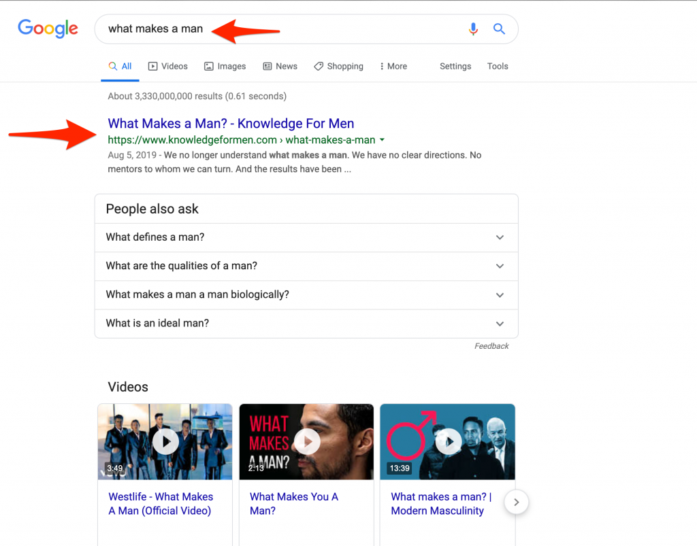
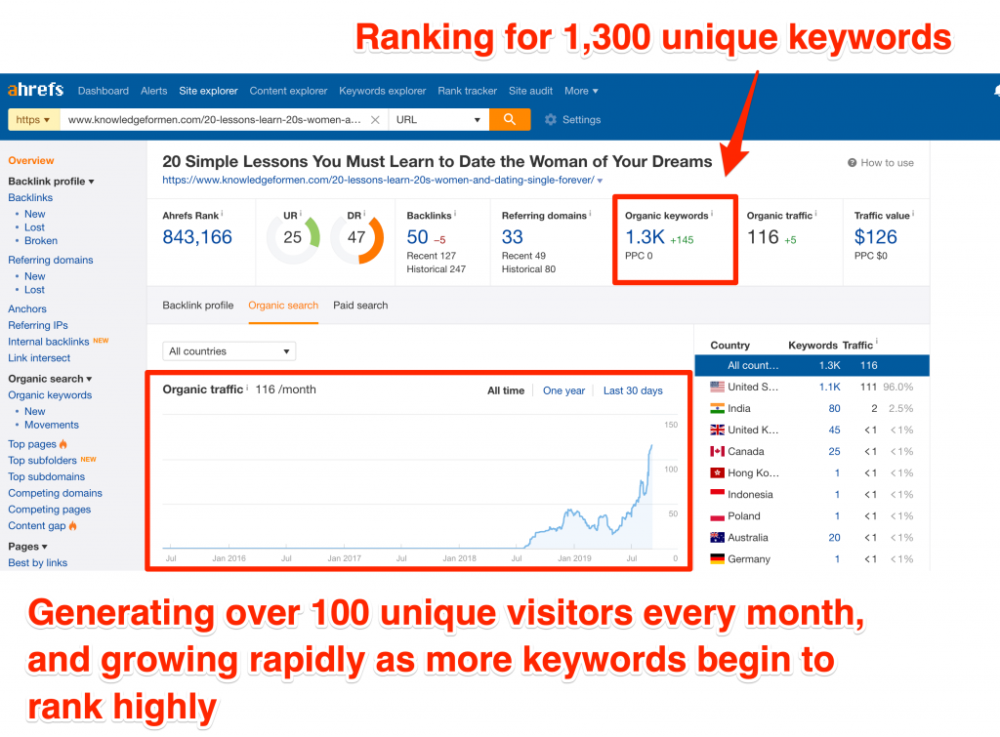
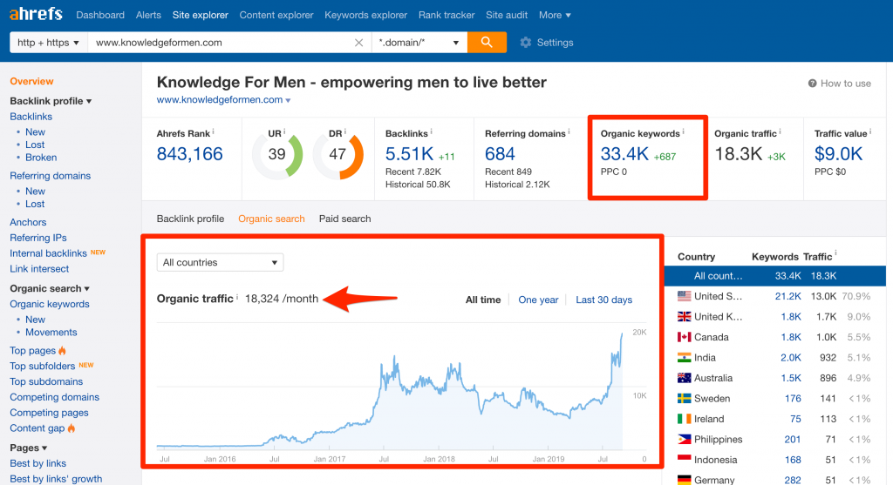
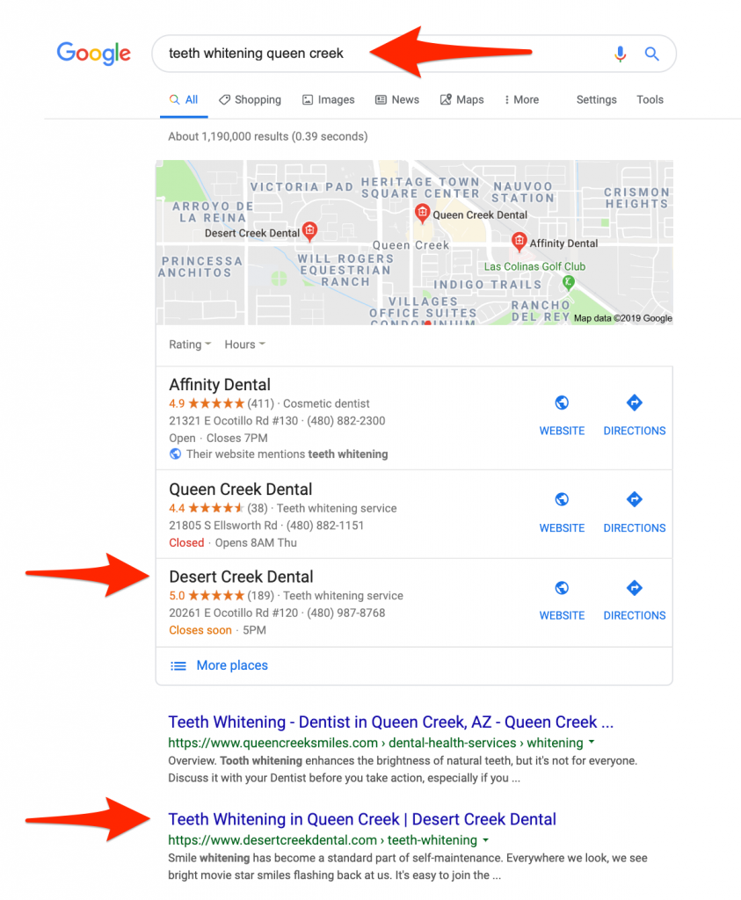
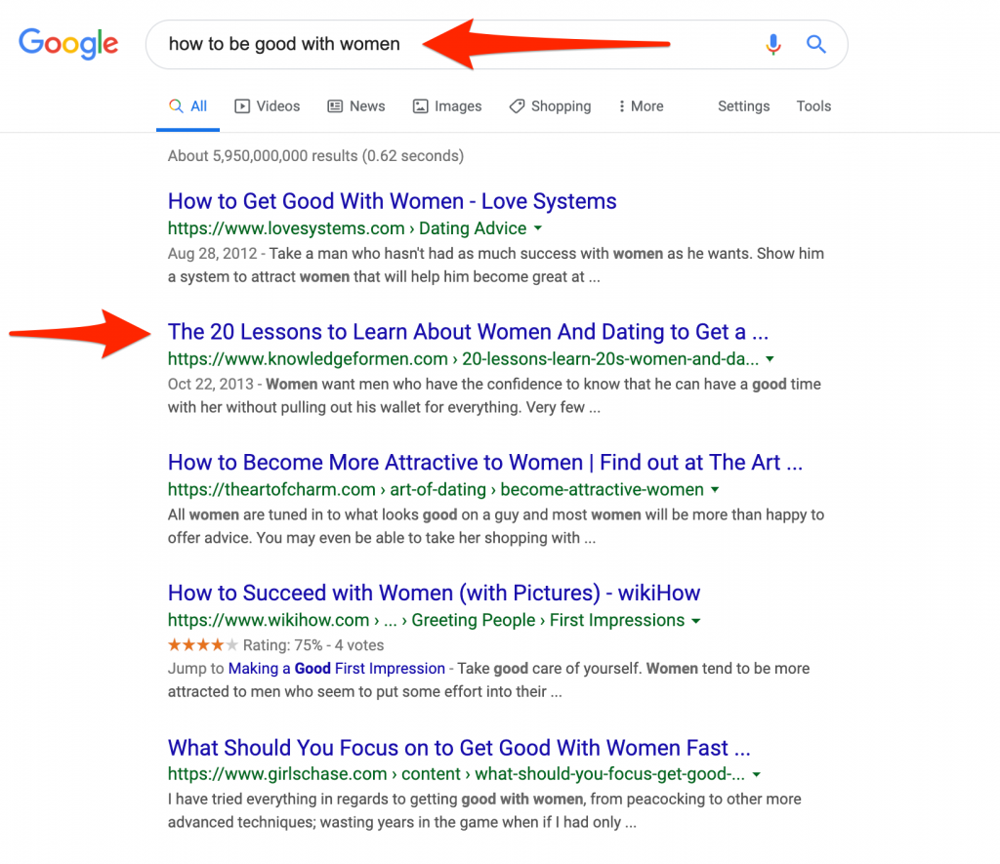

# 

# What is SEO? \[And How it Works\]

SEO, an acronym for “Search Engine Optimization”, is the science (and frankly ART) of bringing people to your website, from search engines, who are likely to be interested in the products and services you provide. 

SEO is quite literally how to optimize a website in such a way that a web crawler (aka algorithm, aka [Googlebot](https://support.google.com/webmasters/answer/182072?hl=en)) that we humans refer to as “a search engine” will like your website more than your competitor’s website, and display your website prominently when someone searches for a product / service you provide. 

How do I do that for my website? How do I make my website show up above my competitors? Well, you “SEO it”.

# **Why is SEO important?**

Why is SEO important? What are the benefits of SEO? 

Great questions… 

Let me answer these questions, with a question: On a scale of 1-10, how likely are people to want what you sell? 

Weird question right? How do you even answer that? There are WAY too many types of people for that question to make any sense. 

How about this question: What if you could identify everyone who is actively, currently (maybe even frantically) looking for your services and then be the first person they call?

* **Newsflash:** You Can.  
* **2nd Newsflash:** It’s Awesome.  
* **3rd Newsflash:** Never do a third newsflash. People stop paying attention after the second.

Okay enough tomfoolery – let’s get into some real life examples\!

# **SEO for a Local Business – Is it beneficial?**

We define “local business” as any business that provides products / services in a geographically restricted capacity. 

**For example:** surgeons, plumbers, lawyers (most), pool cleaners, surf lessons, cryotherapy, funeral home services, etc. 

Suppose you are a Dentist and you have a practice in Queen Creek, Arizona (this is probably not true to your actual situation). 

And suppose that you make some good money if you sell teeth whitening (this however, is in fact, true). 

Well, there are high-schools in that area right? I’m sure that those high schools have prom and that people want to look good for their most important school dance (and the parents probably want them looking sharp for school pictures). 

So what do they do? 

They go to the internet and Google “teeth whitening near me” or “teeth whitening queen creek” or “how to get a date for prom” …. but let’s stick to the teeth whitening example for now. 

So what happens when you Google “teeth whitening queen creek”? 

You see a SERP\! (Search Engine Results Page). It looks like this: 
Well, it looks like that without the arrows at least. 

The arrows are pointing to one of our actual clients who is benefitting from local seo. 

We included the arrows to show you that we aren’t all talk here – we do walk the walk. Even if thine walks be sometimes silly.

SEO literally matches up people **who want your products** with **your business**. 

You know, the types of people that be like: **Shut up and take my money\!**

For the record, I know that “be like” isn’t proper grammar. Okay back to the topic at hand.

SEO is one of the most powerful ways of growing your business by leveraging the most frequented reference book (aka index, aka database) for finding things that the world has ever seen – the internet. And primarily, Google.

# **SEO for a Non Local Business – Is it beneficial?**

We define “non-local business” as any business that provides products / services in a non-geographically restricted capacity. 

Internally, we call them “enterprise” businesses, so you may see that somewhere on our website. Don’t freak out. 

**For example:** an e-commerce brand, a content brand that sells info products, a business coach, an online magazine/publisher, an affiliate website, etc. 

Suppose, this time, you are a content brand that sells informational type products for Men be better at being men, by giving you information about what makes a man a man, you know Knowledge For Men\! 

That was a fun sentence. But looks – this is real.

You provide advice to guys about how to do things that aren’t so common sense. 

And if we’re being honest, most things that have to do with being a guy don’t come as common sense to us guys – so there is actually a very large market for this. 

And suppose that you make some good money by providing awesome content for guys, and then selling them products to help be even better guys (like books, online courses, or even personal coaching). 

Well, remember that prom coming up just around the corner in Queen Creek, Arizona? (and pretty much everywhere else too)? 

Guess what – guys are gonna need help with getting dates, and learning how to talk to girls, and probably even how to tie their shoes.

So what do they do? 

They go to the internet and Google something like “how to date a woman” or “how to be good with women”. 

And what happens when you Google these things? You see a SERP\! (Search Engine Results Page). 

And it looks like this: or this: 

Once again, it looks like that without the arrows. 

Everything we’re talking about here has to do with [search intent](https://serp.co/seo/search-intent/) of [search queries](https://serp.co/seo/search-query/).

The arrows are pointing to one of our actual clients who is benefitting from non-local seo (aka enterprise seo, aka just “seo”). 

And remember what happens when we show you that we aren’t all talk? That we actually walk the walk? Ya, silly.

Once again we have an example of how SEO is driving **people with specific needs** (traffic) to the **place that has the solution** for those specific needs (your business). 

Let’s take a little bit deeper look of what SEO is actually doing for this website:

 

We can see from this screenshot that this ONE article on Knowledge For Men (KFM) is bringing the website over 100 unique visitors every month (and growing rapidly). 

When you start thinking about scaling that effort up (more articles, more SEO) then you begin to produce a HUGE business impact. 

Here is how this is working at scale for the KFM as a whole:

 

You read that right. 

That is 18,324 estimated visitors every month to this website SOLELY from organic search efforts (aka SEO).

# **How does SEO work?**

Okay so first let’s recap:

1. SEO \= “Search Engine Optimization”.  
2. SEO is the process of “doing things to my website” so that the search engines like my website more than my competitors and will display it first.  
3. SEO is like a matchmaker that matches up: “Person with need” to “Business that solves need.”  
4. SEO brings people to your website who need/want the products & services you provide, but don’t necessarily know about you as the provider. They only know what they want to solve, like “teeth whitening near me” or “how to date a woman”. SEO is the connection between that “generic search” to YOUR brand.  
   

Got it? Awesome. 

I want to keep this article at a beginner level, so I’m actually not going to go too in-depth with how seo works from a technical level – we will cover that in an upcoming article. 

But the gist of it is that Google has a very complex [algorithm](https://en.wikipedia.org/wiki/Algorithm) that us SEOs spend all of our time “trying to please”. 

Once we figure out “What A Google Wants” (insert [Christina Aguilera](https://www.youtube.com/watch?v=hpspGHeLOPE) joke) then Google rewards us by putting our website on the top of their search engine & sending us their searches to do with what we please. 

**Inside SERP University we cover this extensively, but for all you newbies here are the 3 most important things you can do for your SEO:**

1. Create good content (like the article you are reading)  
2. Get other websites to link to your content (literally go find relevant websites that are in your industry. Email them. And ask them if they will link to your website from their “Resources” page, or from a relevant article on their blog, etc.)  
3. Make sure your website is setup/structured correctly (just like you would want your house to be built properly and logically, you want you want to do this with your website)

# **Types of SEO**

Just when you thought you had a handle on things, we have to expand on the topic and tell you that there are actually different types of seo. 

Reminds me of those subjects you would learn in school (like Spanish) for years only to find out right before going on the class trip to Spain that “everything you just learned is actually all formal speech people don’t really talk like that, so next year we're gonna have to re-learn a bunch of things right when you thought you had it figured out.” 

But just stick with me and you will get it. 

Just like I learned Spanish. 

Lo prometo. 

**The main types of SEO:**

* [Black Hat SEO](https://serp.co/learn/seo/black-hat-seo/)  
* [White Hat SEO](https://serp.co/university/seo/white-hat-seo/)  
* Technical SEO  
* Content SEO  
* [Local SEO](https://serp.co/seo/local-seo/)  
* [Link Building SEO](https://serp.co/seo/link-building/)

For now, that’s all you need to know. There are different “types” (aka specialties, aka areas of expertise) inside of SEO. We will dive into each one later.